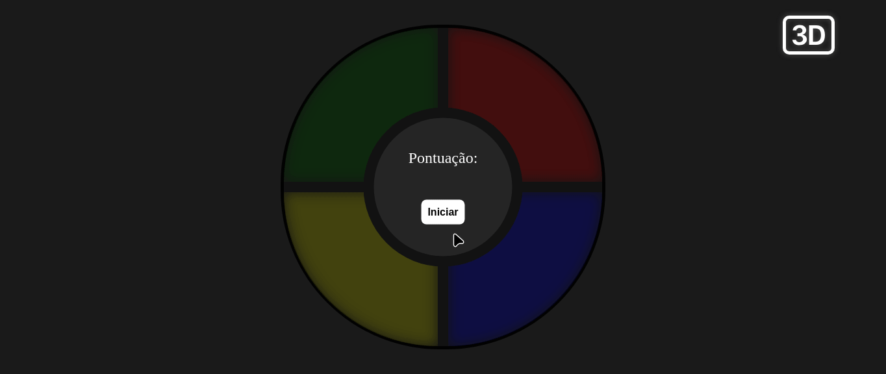

<h1 align="center">Desafio: Jogo Genius 360</h1>

  <a href="#-sobre-o-desafio">Sobre o projeto</a>&nbsp;&nbsp;&nbsp;|&nbsp;&nbsp;&nbsp;
  <a href="#-tecnologias">Tecnologias</a>&nbsp;&nbsp;&nbsp;|&nbsp;&nbsp;&nbsp;

## Sobre o desafio

    Esse projeto foi desenvolvido durante a formação Eduzz Fullstack Developer
    na DIO

    Obs: apliquei efeitos de tranfomação 3D ao elmento, onde receberá o efeito quando clicar no botão 3D.

<h2 align="center">💻 Projeto finalizado</h2>

    

<h3 align="center">Deploy do projeto</h3>

    <a href="https://danieldemoura.github.io/genius" target="_blank">🚀 Acesse por esse link o deploy do projeto</a>

  

### 👨‍💻 Tecnologias

Esse projeto foi desenvolvido com as seguintes tecnologias:

- HTML e CSS
- javascript

---

    Feito com ♥ by <a href="https://www.youtube.com/channel/UCHf8h4M94Wnw5o4deGWZKnw" target="_blank">Daniel</a>

